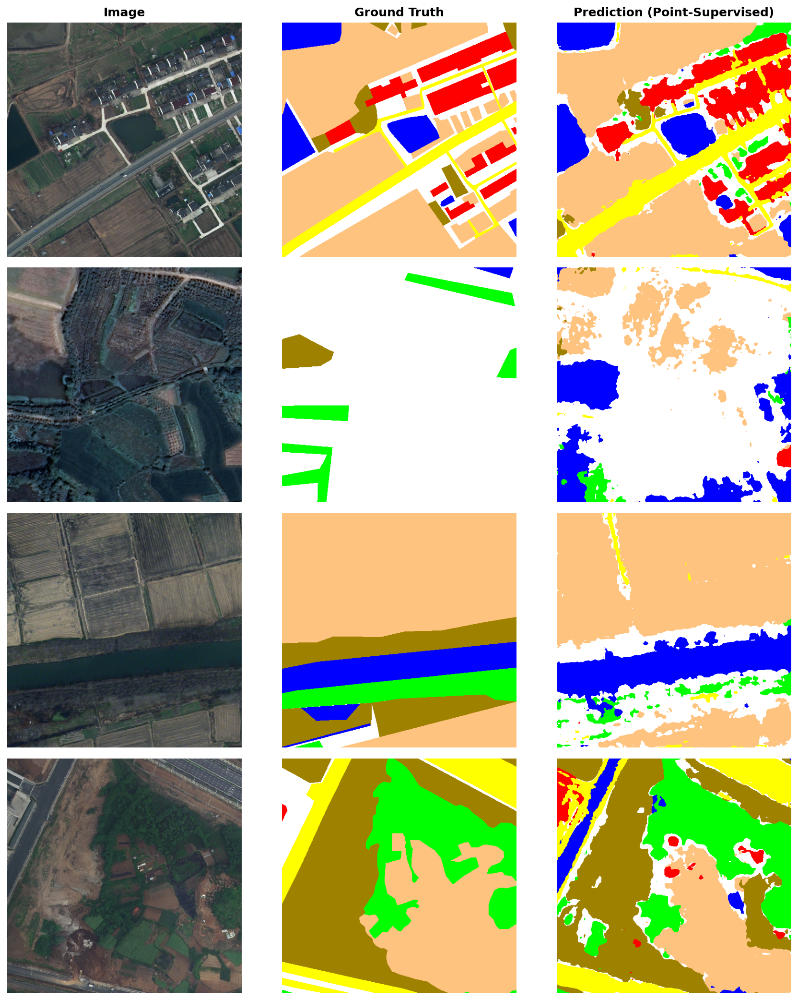

# Point-Supervised Semantic Segmentation for Remote Sensing

[](https://opensource.org/licenses/MIT)
[](https://www.python.org/)
[](https://pytorch.org/)
[](https://zenodo.org/records/5706578)
[](https://arxiv.org)

> **Point-Supervised Semantic Segmentation for Remote Sensing Imagery via Partial Focal Cross-Entropy Loss**  
> *Haris bin Shakeel — 2025*

---

## Overview

This repository implements a **point-supervised semantic segmentation pipeline** for high-resolution remote sensing imagery. Instead of expensive dense pixel-level annotation masks, the model learns from as few as **5 labeled pixels per class per image** — a reduction in annotation effort estimated at 3–7× compared to full-mask labeling.

The core technical contribution is a **Partial Focal Cross-Entropy (PFCE) loss** that:
1. Restricts gradient computation exclusively to labeled (point) pixels, ignoring all unlabeled positions.
2. Applies focal weighting `(1 - p_t)^γ` to concentrate learning on hard, minority-class examples.

Trained on the [LoveDA](https://zenodo.org/records/5706578) benchmark (NeurIPS 2021) with DeepLabV3+ (ResNet-50), the 5-point focal configuration achieves **44.35% mIoU — 97.5% of the fully supervised baseline (45.48% mIoU)**.

---

## Key Results

| Configuration | Points/Class | γ | mIoU (%) | vs. Full Supervision |
|:---|:---:|:---:|:---:|:---:|
| Full Supervision (baseline) | All | — | **45.48** | — |
| Point-Supervised (k=1) | 1 | 2.0 | 36.93 | −8.55 pp |
| Point-Supervised (k=5, no focal) | 5 | 0.0 | 41.30 | −4.18 pp |
| **Point-Supervised (k=5, focal)** | **5** | **2.0** | **44.35** | **−1.13 pp** |
| Point-Supervised (k=10) | 10 | 2.0 | 43.70 | −1.78 pp |

> **Finding:** 5 points per class with focal weighting recovers **97.5%** of full-supervision accuracy, demonstrating that sparse annotations can be a viable substitute for dense masks in remote sensing segmentation.

---

## Qualitative Results



*Left: Input RGB image. Center: Dense ground-truth mask. Right: Prediction using only 5 labeled points per class.*

**Class color legend:**
- ⬜ Background &nbsp; 🟥 Building &nbsp; 🟨 Road &nbsp; 🟦 Water &nbsp; 🟫 Barren &nbsp; 🟩 Forest &nbsp; 🟧 Agriculture

---

## Method

### Partial Focal Cross-Entropy Loss

```python
class PartialFocalCELoss(nn.Module):
    """
    Computes cross-entropy loss only at labeled (point-annotated) pixels.
    Focal weighting focuses learning on hard, minority-class examples.

    Args:
        gamma (float): Focal modulation exponent. 0 = standard masked CE.
        ignore_index (int): Label value to ignore (255 = unlabeled pixels).
    """
    def __init__(self, gamma=2.0, ignore_index=255):
        super().__init__()
        self.gamma = gamma
        self.ignore_index = ignore_index
        self.ce = nn.CrossEntropyLoss(reduction='none', ignore_index=ignore_index)

    def forward(self, logits, target, mask_labeled):
        ce_loss = self.ce(logits, target)           # per-pixel CE
        pt = torch.exp(-ce_loss)                    # estimated softmax prob
        focal_loss = ((1 - pt) ** self.gamma) * ce_loss
        masked_loss = focal_loss * mask_labeled     # zero out unlabeled pixels
        return masked_loss.sum() / (mask_labeled.sum() + 1e-7)
```

The loss in mathematical notation:

$$\mathcal{L}_\text{PFCE} = \frac{\sum_{p,q} s[p,q] \cdot (1 - p_t[p,q])^\gamma \cdot L[p,q]}{\sum_{p,q} s[p,q] + \varepsilon}$$

where `s[p,q]` is the supervision mask (1 at labeled points, 0 elsewhere), `p_t = exp(-CE)` is the estimated class probability, and `ε = 1e-7` prevents division by zero.

### Architecture

- **Backbone:** ResNet-50 (ImageNet pretrained)
- **Decoder:** DeepLabV3+ with ASPP (dilation rates: 6, 12, 18)
- **Output:** 7-class segmentation map at full input resolution
- **Library:** [`segmentation-models-pytorch`](https://github.com/qubvel/segmentation_models.pytorch)

### Point Sampling

At each training step, `k` pixels per class are sampled uniformly at random from the dense ground-truth mask. This **on-the-fly sampling** acts as annotation augmentation — the model sees different label subsets each epoch.

```python
def simulate_point_labels(mask, num_points_per_class=5):
    h, w = mask.shape
    mask_labeled = np.zeros((h, w), dtype=np.float32)
    gt_labels = np.full((h, w), 255, dtype=np.int64)   # 255 = ignore
    for c in np.unique(mask):
        if c == 255: continue
        coords = np.argwhere(mask == c)
        n = min(len(coords), num_points_per_class)
        selected = coords[np.random.choice(len(coords), n, replace=False)]
        for r, col in selected:
            mask_labeled[r, col] = 1.0
            gt_labels[r, col] = c
    return mask_labeled, gt_labels
```

---

## Dataset

**LoveDA** — Land-cOVEr Domain Adaptive Semantic Segmentation (NeurIPS 2021)

| Split | Images | Resolution | Classes |
|:---|:---:|:---:|:---:|
| Train | 2,522 | 1024×1024 @ 0.3m/px | 7 |
| Validation | 1,669 | 1024×1024 @ 0.3m/px | 7 |

Classes: Background, Building, Road, Water, Barren, Forest, Agriculture

Labels use a 1-indexed scheme; a `−1` offset is applied during loading to produce 0-indexed class IDs.

---

## Installation

```bash
# Clone the repository
git clone https://github.com/Haris-bin-shakeel/point-supervised-rs-segmentation.git
cd point-supervised-rs-segmentation

# Create a virtual environment (recommended)
python -m venv venv
source venv/bin/activate  # Windows: venv\Scripts\activate

# Install dependencies
pip install torch torchvision --index-url https://download.pytorch.org/whl/cu118
pip install segmentation-models-pytorch albumentations opencv-python scikit-learn tqdm matplotlib
```

**Requirements:**
```
torch>=2.0
torchvision>=0.15
segmentation-models-pytorch>=0.3
albumentations>=1.3
opencv-python
scikit-learn
tqdm
matplotlib
numpy
Pillow
```

---

## Data Preparation

```bash
# Download LoveDA dataset
wget https://zenodo.org/records/5706578/files/Train.zip
wget https://zenodo.org/records/5706578/files/Val.zip

unzip Train.zip -d data/
unzip Val.zip -d data/
```

Expected directory structure:
```
data/
├── Train/
│   ├── Urban/
│   │   ├── images_png/
│   │   └── masks_png/
│   └── Rural/
│       ├── images_png/
│       └── masks_png/
└── Val/
    ├── Urban/
    │   ├── images_png/
    │   └── masks_png/
    └── Rural/
        ├── images_png/
        └── masks_png/
```

---

## Usage

### Training — Point-Supervised

```python
from dataset import LoveDADataset
from loss import PartialFocalCELoss
from model import get_model
from train import train_one_epoch, validate

# Configuration
k = 5          # points per class
gamma = 2.0    # focal exponent

train_dataset = LoveDADataset("data/Train", num_points=k, transform=get_transforms(train=True))
val_dataset   = LoveDADataset("data/Val",   transform=get_transforms(train=False))

train_loader = DataLoader(train_dataset, batch_size=4, shuffle=True)
val_loader   = DataLoader(val_dataset,   batch_size=4, shuffle=False)

model     = get_model(num_classes=7).cuda()
criterion = PartialFocalCELoss(gamma=gamma)
optimizer = torch.optim.Adam(model.parameters(), lr=1e-4)

for epoch in range(30):
    loss = train_one_epoch(model, train_loader, criterion, optimizer, device)
    miou, per_class_iou = validate(model, val_loader, device)
    print(f"Epoch {epoch+1}: Loss={loss:.4f}  mIoU={miou:.4f}")
```

### Evaluation — Pretrained Weights

```python
import torch
from model import get_model

model = get_model(num_classes=7)
model.load_state_dict(torch.load("weights/best_point_model_k5g2.pth"))
model.eval().cuda()

# Run inference
with torch.no_grad():
    logits = model(image_tensor.unsqueeze(0).cuda())
    pred   = torch.argmax(logits, dim=1).squeeze().cpu().numpy()
```

### Run Full Ablation

```python
python run_ablation.py \
    --train_dir data/Train \
    --val_dir   data/Val   \
    --epochs    5          \
    --output    results/
```

---

## Pretrained Weights

| Config | mIoU | Download |
|:---|:---:|:---:|
| k=5, γ=2 (best) | 44.35% | [`best_point_model_k5g2.pth`](weights/best_point_model_k5g2.pth) |

---

## Repository Structure

```
point-supervised-rs-segmentation/
├── notebook/
│   └── point_supervised_loveda.ipynb   # Full experimental notebook (Kaggle/Colab)
├── weights/
│   └── best_point_model_k5g2.pth       # Best point-supervised model weights
├── results/
│   ├── results_final.json              # Final ablation results
│   └── results_checkpoint.json         # Per-experiment checkpoints
├── figures/
│   ├── qualitative.png                 # Qualitative predictions
│   └── miou_vs_points.png              # mIoU vs. annotation density plot
├── paper/
│   ├── paper_main.tex                  # Overleaf-ready LaTeX paper
│   └── references.bib                  # BibTeX references
├── dataset.py                          # LoveDADataset + point sampling
├── loss.py                             # PartialFocalCELoss
├── model.py                            # DeepLabV3+ model factory
├── train.py                            # Training and validation loops
├── run_ablation.py                     # Full ablation runner script
├── requirements.txt
└── README.md
```

---

## Ablation Study Details

### Effect of Annotation Density (k) and Focal Weighting (γ)

```
mIoU vs. Points per Class (all with γ=2)

45 |                     ●  (Full Supervision = 45.48%)
44 |               ●
43 |                          ●
42 |
41 |
40 |
39 |
38 |
37 |     ●
   +--+--+--+--+--+--+--+--+--+--
      1        5            10
         Points per Class (k)
```

**Key findings:**
- Focal weighting (`γ=2`) improves mIoU by **+3.05 pp** over standard masked CE at k=5.
- Performance peaks at **k=5** and declines at k=10, suggesting the 5-epoch schedule is insufficient to absorb additional annotation density.
- The k=5, γ=2 configuration recovers **97.5%** of full-supervision accuracy.

---

## Limitations

This work makes no claim to state-of-the-art performance. Acknowledged limitations:

- **Short training schedule** (5 epochs): results may not be fully converged.
- **Single random seed**: variance from stochastic point sampling is not characterised.
- **No spatial regularisation**: CRF post-processing or consistency loss would likely improve boundary quality.
- **Incomplete ablation grid**: not all (k, γ) combinations were evaluated.
- **Single architecture**: only DeepLabV3+/ResNet-50 is tested.

---

## Citation

If you use this code or build upon this work, please cite:

```bibtex
@misc{shakeel2025pointsupervised,
  title   = {Point-Supervised Semantic Segmentation for Remote Sensing Imagery
             via Partial Focal Cross-Entropy Loss},
  author  = {Shakeel, Haris bin},
  year    = {2025},
  url     = {https://github.com/Haris-bin-shakeel/point-supervised-rs-segmentation}
}
```

---

## Related Work

| Paper | Contribution | Relevance |
|:---|:---|:---|
| [LoveDA (NeurIPS'21)](https://arxiv.org/abs/2110.08733) | Remote sensing segmentation benchmark | Dataset used |
| [DeepLabV3+ (ECCV'18)](https://arxiv.org/abs/1802.02611) | Encoder-decoder with ASPP | Architecture used |
| [Focal Loss (ICCV'17)](https://arxiv.org/abs/1708.02002) | Class-imbalance loss weighting | Core loss component |
| [What's the Point? (ECCV'16)](https://arxiv.org/abs/1506.02106) | Point supervision for segmentation | Problem formulation |
| [ScribbleSup (CVPR'16)](https://arxiv.org/abs/1604.05144) | Scribble-supervised segmentation | Related weak supervision |

---

## License

MIT License. See [LICENSE](LICENSE) for details.

---

## Contact

**Haris bin Shakeel**  
GitHub: [@Haris-bin-shakeel](https://github.com/Haris-bin-shakeel)

*Contributions, issues, and pull requests are welcome.*
